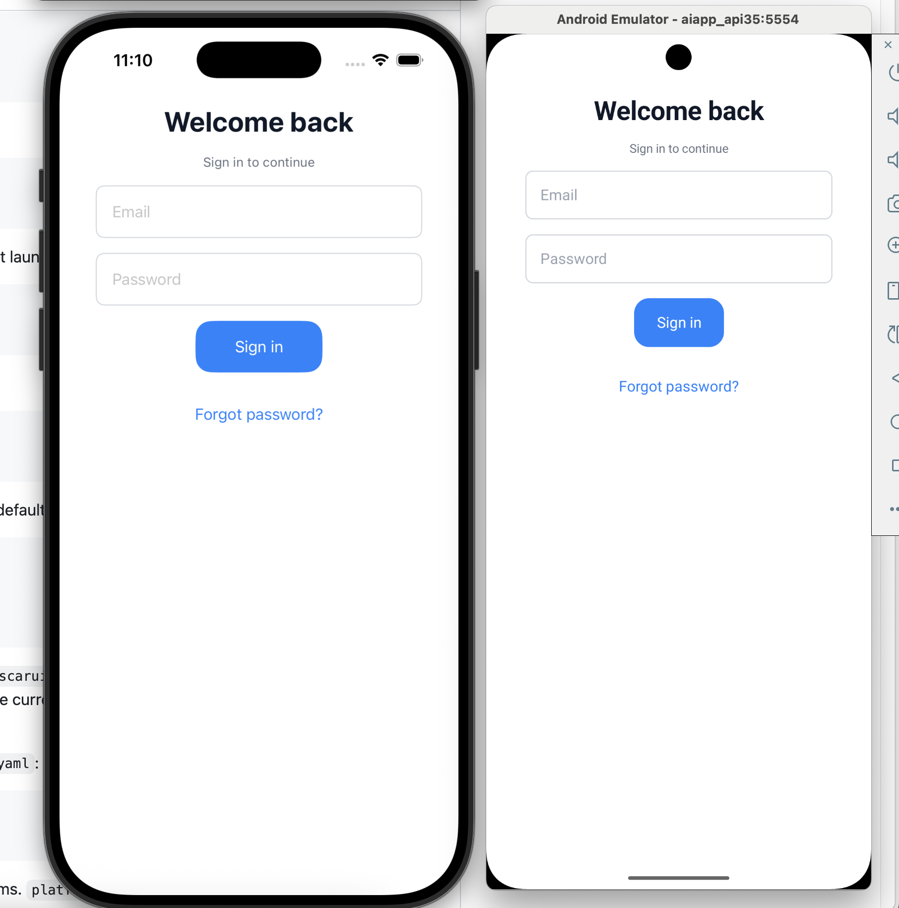

# OscarUI

[English](README.md) | 简体中文

OscarUI 是一个 UI 编译器原型：用一份 UI 意图描述文件生成 iOS SwiftUI 和 Android Jetpack Compose 原生界面。
这个名字可以解释为 Open Source Cross Apple/Android Renderer。

> **一个 AI，两个真正的原生 App：iOS 用 Swift，Android 用 Kotlin。**
>
> OscarUI 想做的事情很简单：只开一个 AI，只描述一次 UI，同时写出两个原生 App。AI 负责修改共享的 UI 意图，确定性编译器为 iOS 生成可验证的 Swift/SwiftUI 代码，为 Android 生成 Kotlin/Jetpack Compose 代码——不是 WebView，也不是跨端运行时套壳。

核心思路是把 AI 的不确定性限制在 `src/screens/*.ui.yaml` 这类 IR 文件里，再由确定性编译器生成两端原生代码。同一份 IR 输入，应产生可重复、可验证的原生输出。

## 效果展示

同一份登录页 IR，分别渲染为 iOS 原生 SwiftUI 和 Android 原生 Jetpack Compose 界面：



## 快速开始

安装依赖：

```sh
npm install
```

校验 IR：

```sh
npm run validate
```

生成两端代码：

```sh
npm run build
```

构建可选的版本化 Runtime bundle 和两端原生解释器：

```sh
npm run build:runtime
npm run runtime:parity
```

运行轻量测试：

```sh
npm test
```

生成给下一轮 AI 修改使用的确定性反馈：

```sh
npm run author:loop
```

生成并保存两端截图：

```sh
npm run snapshots
```

截图会保存到 `.aic/snapshots/`。

比较已保存截图的基础元数据：

```sh
npm run snapshots:diff
```

## 日常工作流

改 UI 时，优先编辑：

- `src/screens/*.ui.yaml`: 页面结构和 UI 意图
- `src/components/*.ui.yaml`: 可复用组件 UI 意图
- `src/app.config.yaml`: App 标识、平台设置、权限、隐私文案、链接和方向
- `src/theme/tokens.yaml`: spacing、radius、color、typography、size 等设计 token
- `schema/ui-ir.schema.json`: 允许使用的 IR 能力
- `compiler/*.mjs`: IR 到 SwiftUI / Compose 的确定性模板

不要手改：

- `generated/ios/*.swift`
- `generated/android/*.kt`
- `generated/runtime/`
- `.aic/ios/`
- `.aic/android/`

这些都是生成产物，下次构建会被覆盖。

推荐改动循环：

```sh
npm run validate
npm run build
npm run snapshots
```

如果只想确认本机工具链：

```sh
npm run doctor:ios
npm run doctor:android
```

如果只想看宿主工程和命令计划，不启动模拟器：

```sh
npm run dry-run:ios
npm run dry-run:android
```

如果要真实构建、安装并启动 App：

```sh
npm run dev:ios
npm run dev:android
```

Runtime Mode 保持为可选能力，稳定默认路径仍是 Compile Mode：

```sh
npm run dry-run:ios:runtime
npm run dry-run:android:runtime
npm run dev:ios:runtime
npm run dev:android:runtime
```

可移植 bundle 输出到 `generated/runtime/oscarui.runtime.json`。两端运行时会在激活前校验 SHA-256 与兼容区间，保留 current/last-known-good 缓存，并可按 `src/app.config.yaml` 的配置拉取 HTTPS 更新。

可以在 `src/app.config.yaml` 全局配置路由动画：

```yaml
navigation:
  animation: none # none | platform
```

`none` 会同时关闭两端的 push/pop 动画；`platform` 保留 SwiftUI 和 Compose 的平台默认动画。

不重新编译 App，直接向已运行的 debug App 安装新 bundle：

```sh
npm run runtime:install:ios
npm run runtime:install:android
```

分别采集 Compile/Runtime 截图、按平台比较，并维护视觉基线：

```sh
npm run snapshots
npm run snapshots:runtime
npm run snapshots:runtime-parity
npm run snapshots:accept
npm run author:visual-review
```

把受限 Figma JSON 导入为草稿 screen：

```sh
npm run figma:import -- path/to/figma.json src/screens/imported.ui.yaml
```

校验插件 manifest：

```sh
npm run plugins:validate
```

## UI IR 示例

当前登录页在 `src/screens/login.ui.yaml`：

```yaml
screen: Login
title: Login

layout:
  safeArea: true
  contentPosition: top
  contentWidth: compact

state:
  - name: email
    type: string
  - name: password
    type: string

body:
  - type: column
    spacing: normal
    padding: normal
    align: center
    children:
      - type: text
        role: title
        value: Welcome back
      - type: text
        role: caption
        value: Sign in to continue
        color: textSecondary
      - type: textField
        bind: email
        placeholder: Email
        keyboard: email
      - type: textField
        bind: password
        placeholder: Password
        secure: true
      - type: button
        role: primary
        label: Sign in
        action: login
      - type: button
        role: ghost
        label: Forgot password?
        action: forgotPassword

actions:
  - name: login
    steps: [validate, call_api, save_token, navigate]
  - name: forgotPassword
    steps: [navigate]
```

IR 里应引用 token 名，比如 `spacing: normal`、`contentWidth: compact`，不要写裸数值。

## 组件引用

可复用组件放在 `src/components/*.ui.yaml`。页面可以用 `use` 引用组件，也可以和简单的 `for` 循环、`if` 条件组合：

```yaml
- use: component
  path: ../components/projectCard.ui.yaml
  for: project in projects
  title: project.name
  subtitle: project.platform
  onSelect: selectProject

- use: EmptyState
  if:
    state: isEmpty
    equals: true
```

编译器会先把这种短写法 normalize 成标准 list/component IR，再生成 SwiftUI 和 Compose。props 也可以继续放在嵌套的 `props:` 下面，哪种更清楚就用哪种。

## native 目录

`src/native/` 用来放手写原生 action 实现。

例如 IR 里声明了：

```yaml
action: login
```

编译器会生成：

- iOS: `LoginActions`
- Android: `LoginActions`

实际业务逻辑写在：

- `src/native/ios/LoginActionsImpl.swift`
- `src/native/android/LoginActionsImpl.kt`

这里适合写登录、跳转、API 请求、保存 token、接入第三方 SDK 等平台原生逻辑。不要在 `src/native/` 里手写页面 UI；页面结构仍然由 `src/screens/*.ui.yaml` 管。

## 目录说明

```text
oscarui/
├── src/
│   ├── screens/             # UI IR，页面源码
│   ├── components/          # 可复用组件 IR
│   ├── app.config.yaml      # App 标识、平台、权限和链接源码
│   ├── theme/               # 设计 token
│   └── native/              # 手写原生 action 实现
├── schema/                  # IR schema，限制可用 UI 能力
├── compiler/                # 确定性编译器和 CLI
├── plugins/                 # 可选的确定性流水线扩展
├── generated/               # 生成的 SwiftUI / Compose 代码
└── .aic/                    # 本地宿主工程、构建缓存和截图
```

## 项目进度

阶段进度单独维护在 [`ROADMAP.md`](ROADMAP.md)，README 只保留项目介绍和日常使用说明。
